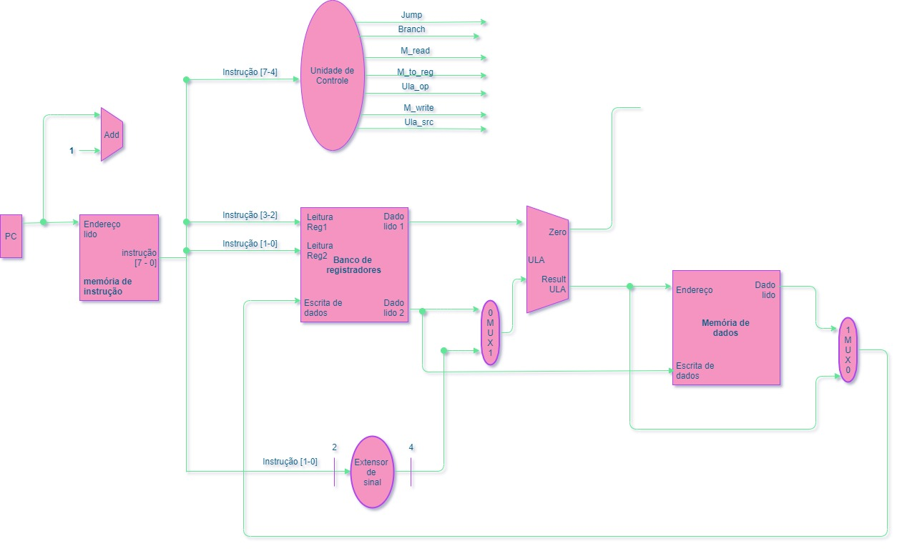
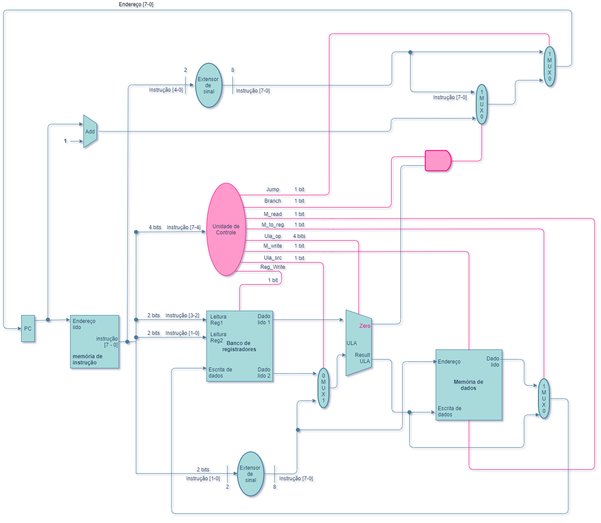

Data             |  Progresso | Dúvidas             | Imagem |  Link
:-------------------------:|:-------------------------:|:-------------------------:|:-------------------------:|:-------------------------:
20 de abril de 2021 | Começamos a contruir o datapath do processador  | Como o Program Counter funciona? Devemos entender primeiramente cada unidade funcional? O program ounter será incrementado infinitamente? |   | Pegamos como base o [Datapath MIPS 32](https://cdn.discordapp.com/attachments/708882394400292935/834136976214851644/Datapath.png)
21 de abril de 2021 | Finalizamos o datapath | . |  | Utilizamos a plataforma [Draw.io](https://app.diagrams.net/)
